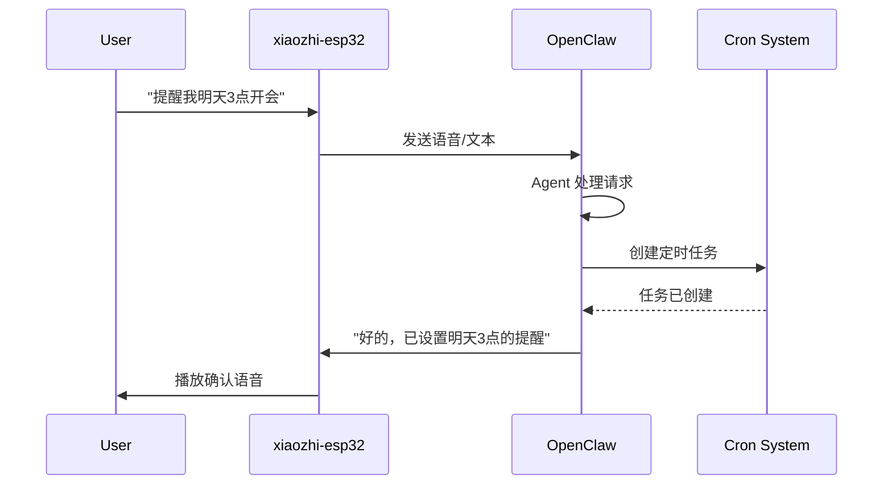
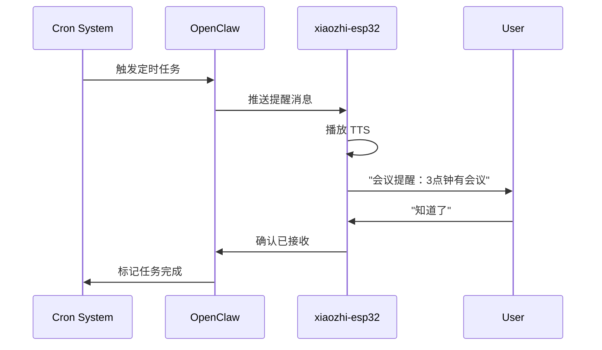

# xiaozhi-esp32 与 OpenClaw 深度集成方案

## 概述

本方案将 xiaozhi-esp32 智能语音设备与 OpenClaw AI 助手平台深度集成，实现：

- 通过语音与 OpenClaw 交互
- 定时任务和语音提醒
- 双向实时通信
- 物联网设备控制

## 架构设计

### 1. 整体架构

```
┌─────────────────────────────────────────────────────────────┐
│                      OpenClaw 平台                           │
│  ┌──────────────┐  ┌──────────────┐  ┌──────────────┐      │
│  │  Agent Core  │  │  Cron System │  │   Gateway    │      │
│  └──────┬───────┘  └──────┬───────┘  └──────┬───────┘      │
│         │                  │                  │              │
│  ┌──────┴──────────────────┴──────────────────┴───────┐    │
│  │         xiaozhi Channel Plugin                      │    │
│  │  - Message Routing                                  │    │
│  │  - Device Registry                                  │    │
│  │  - Push Notifications                               │    │
│  └─────────────────────────────────────────────────────┘    │
└────────────────────────────┬────────────────────────────────┘
                             │
                    MQTT/WebSocket
                             │
┌────────────────────────────┴────────────────────────────────┐
│                   xiaozhi-esp32 设备                         │
│  ┌──────────────┐  ┌──────────────┐  ┌──────────────┐      │
│  │ Audio I/O    │  │  Protocol    │  │  MCP Client  │      │
│  │ (Opus)       │  │  Handler     │  │              │      │
│  └──────────────┘  └──────────────┘  └──────────────┘      │
└─────────────────────────────────────────────────────────────┘
```

### 2. 通信协议选择

支持三种协议模式：

#### 模式 A: WebSocket（推荐用于开发/测试）

- **优点**: 实现简单，防火墙友好，双向实时通信
- **缺点**: 需要保持长连接
- **适用场景**: 家庭网络，开发调试

#### 模式 B: MQTT + UDP（推荐用于生产）

- **优点**: 低延迟音频传输，支持离线消息
- **缺点**: 需要 MQTT Broker，UDP 需要端口映射
- **适用场景**: 生产环境，多设备管理

#### 模式 C: HTTP Push（推荐用于远程控制）

- **优点**: 无需保持连接，支持公网访问，简单易用
- **缺点**: 单向推送，延迟较高
- **适用场景**: 远程提醒推送，跨网络通知，第三方集成

## 核心功能设计

### 3. 消息路由

#### 3.1 设备 → OpenClaw（语音输入）

```json
{
  "type": "message",
  "device_id": "xiaozhi-001",
  "session_id": "session-123",
  "content": {
    "text": "提醒我明天下午3点开会",
    "audio_duration_ms": 2500
  },
  "timestamp": 1738656000000
}
```

OpenClaw 处理流程：

1. 接收设备消息
2. 路由到对应的 Agent 会话
3. 执行任务（创建提醒）
4. 返回确认消息

#### 3.2 OpenClaw → 设备（推送通知）

```json
{
  "type": "notification",
  "notification_id": "notif-456",
  "priority": "high",
  "content": {
    "text": "会议提醒：3点钟有会议",
    "tts": true,
    "led_effect": "pulse_blue"
  },
  "timestamp": 1738656000000
}
```

### 4. 定时任务集成

#### 4.1 创建提醒任务

用户通过语音说："提醒我明天下午3点开会"

OpenClaw Agent 处理：

```typescript
// Agent 使用 cron tool 创建任务
{
  "tool": "cron_add",
  "params": {
    "name": "会议提醒",
    "schedule": {
      "kind": "at",
      "atMs": 1738656000000  // 明天下午3点
    },
    "sessionTarget": "isolated",
    "wakeMode": "now",
    "payload": {
      "kind": "agentTurn",
      "message": "发送会议提醒到设备 xiaozhi-001",
      "deliver": true,
      "channel": "xiaozhi",
      "to": "xiaozhi-001"
    }
  }
}
```

#### 4.2 定时任务执行

到达指定时间时：

1. OpenClaw Cron 系统触发任务
2. 通过 xiaozhi channel 发送消息到设备
3. 设备播放 TTS 语音提醒
4. 设备可选择性显示 LED 效果

### 5. 双向交互流程

#### 场景 1: 语音创建提醒



#### 场景 2: 定时提醒触发



## 实现方案

### 6. OpenClaw 插件结构

创建新的 channel plugin: `extensions/xiaozhi/`

```
extensions/xiaozhi/
├── package.json
├── index.ts                 # 插件入口
├── src/
│   ├── channel.ts          # Channel 定义
│   ├── gateway.ts          # Gateway 适配器
│   ├── messaging.ts        # 消息处理
│   ├── device-registry.ts  # 设备注册管理
│   ├── protocol/
│   │   ├── websocket.ts    # WebSocket 协议
│   │   └── mqtt.ts         # MQTT 协议
│   └── types.ts            # 类型定义
└── README.md
```

### 7. 配置示例

#### OpenClaw 配置 (`~/.openclaw/config.json5`)

```json5
{
  channels: {
    xiaozhi: {
      enabled: true,
      protocol: "websocket", // 或 "mqtt"

      // WebSocket 模式配置
      websocket: {
        port: 8765,
        path: "/xiaozhi",
        auth: {
          tokens: ["your-device-token-here"],
        },
      },

      // MQTT 模式配置（可选）
      mqtt: {
        broker: "mqtt://localhost:1883",
        username: "openclaw",
        password: "your-password",
        topics: {
          device_prefix: "xiaozhi/devices/",
          command_prefix: "xiaozhi/commands/",
        },
      },

      // 设备配置
      devices: {
        "xiaozhi-001": {
          name: "客厅小智",
          enabled: true,
          features: {
            tts: true,
            led: true,
            mcp: true,
          },
        },
      },

      // 提醒配置
      reminders: {
        default_voice: "zh-CN-XiaoxiaoNeural",
        led_effects: {
          reminder: "pulse_blue",
          urgent: "flash_red",
        },
      },
    },
  },

  agents: {
    default: {
      tools: {
        xiaozhi_notify: {
          enabled: true,
        },
      },
    },
  },
}
```

#### xiaozhi-esp32 配置

**WebSocket 模式:**

```json
{
  "websocket": {
    "url": "ws://your-openclaw-server:8765/xiaozhi",
    "token": "your-device-token-here",
    "version": 3
  }
}
```

**MQTT 模式:**

```json
{
  "mqtt": {
    "endpoint": "mqtt://your-openclaw-server:1883",
    "client_id": "xiaozhi-001",
    "username": "openclaw",
    "password": "your-password",
    "publish_topic": "xiaozhi/devices/xiaozhi-001/messages",
    "subscribe_topic": "xiaozhi/commands/xiaozhi-001"
  }
}
```

### 8. Agent 工具扩展

为 OpenClaw Agent 添加设备控制工具：

```typescript
// xiaozhi_notify 工具
{
  name: "xiaozhi_notify",
  description: "发送通知到 xiaozhi 设备",
  input_schema: {
    type: "object",
    properties: {
      device_id: {
        type: "string",
        description: "设备 ID，如 'xiaozhi-001'"
      },
      message: {
        type: "string",
        description: "要发送的消息内容"
      },
      priority: {
        type: "string",
        enum: ["low", "normal", "high", "urgent"],
        description: "消息优先级"
      },
      tts: {
        type: "boolean",
        description: "是否使用语音播报"
      },
      led_effect: {
        type: "string",
        description: "LED 灯效，如 'pulse_blue'"
      }
    },
    required: ["device_id", "message"]
  }
}
```

### 9. 使用场景示例

#### 场景 A: 日程提醒

**用户**: "小智，提醒我明天早上8点吃药"

**OpenClaw 处理**:

1. 解析时间：明天早上8点
2. 创建 cron 任务
3. 设置推送到设备 xiaozhi-001

**到时触发**:

- 设备播放："吃药提醒，现在是早上8点"
- LED 灯闪烁蓝色

#### 场景 B: 重复提醒

**用户**: "每天晚上9点提醒我关灯"

**OpenClaw 处理**:

```typescript
{
  schedule: {
    kind: "cron",
    expr: "0 21 * * *",  // 每天21:00
    tz: "Asia/Shanghai"
  },
  payload: {
    kind: "agentTurn",
    message: "发送关灯提醒",
    channel: "xiaozhi",
    to: "xiaozhi-001"
  }
}
```

#### 场景 C: 智能家居联动

**用户**: "小智，开灯"

**处理流程**:

1. 设备发送消息到 OpenClaw
2. OpenClaw Agent 识别意图
3. 通过 MCP 协议控制智能灯
4. 返回确认消息到设备

## 安全考虑

### 10. 认证与授权

1. **设备认证**:
   - 每个设备使用唯一 token
   - Token 存储在设备 NVS 中
   - 支持 token 轮换

2. **消息加密**:
   - WebSocket: 使用 WSS (TLS)
   - MQTT: 使用 MQTTS (TLS)
   - UDP 音频: AES-CTR 加密

3. **访问控制**:
   - 设备白名单
   - 命令权限控制
   - 敏感操作需要二次确认

## 部署指南

### 11. 快速开始

#### 步骤 1: 安装 OpenClaw 插件

```bash
cd openclaw
pnpm install
# 插件会自动加载
```

#### 步骤 2: 配置 OpenClaw

```bash
openclaw config set channels.xiaozhi.enabled true
openclaw config set channels.xiaozhi.protocol websocket
openclaw config set channels.xiaozhi.websocket.port 8765
```

#### 步骤 3: 启动 Gateway

```bash
openclaw gateway run --bind 0.0.0.0 --port 18789
```

#### 步骤 4: 配置设备

在 xiaozhi-esp32 设备上配置 WebSocket URL：

```
ws://your-server-ip:8765/xiaozhi
```

#### 步骤 5: 测试连接

```bash
openclaw channels status xiaozhi
```

### 12. 故障排查

**问题**: 设备无法连接

**检查**:

1. 网络连通性: `ping your-server-ip`
2. 端口开放: `telnet your-server-ip 8765`
3. Token 是否正确
4. 查看 OpenClaw 日志: `openclaw gateway logs`

**问题**: 提醒未触发

**检查**:

1. Cron 任务状态: `openclaw cron list`
2. 设备在线状态: `openclaw channels status xiaozhi`
3. 时区设置是否正确

## 扩展功能

### 13. 未来增强

1. **多设备协同**: 支持多个 xiaozhi 设备同步
2. **语音唤醒**: 通过语音唤醒 OpenClaw Agent
3. **情景模式**: 预设场景（如"早安模式"、"睡眠模式"）
4. **家庭成员识别**: 通过声纹识别不同用户
5. **离线模式**: 设备端缓存常用功能

## 总结

本方案通过创建 OpenClaw channel plugin，将 xiaozhi-esp32 设备深度集成到 OpenClaw 平台，实现：

✅ 语音交互与 AI 助手
✅ 定时任务和提醒
✅ 双向实时通信
✅ 物联网设备控制
✅ 可扩展的架构设计

下一步可以开始实现核心插件代码。
